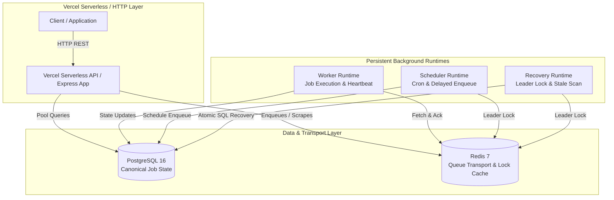

# Flux ⚡

[](https://nodejs.org/)
[](https://www.typescriptlang.org/)
[](https://expressjs.com/)
[](https://www.postgresql.org/)
[](https://redis.io/)
[](https://www.docker.com/)
[](LICENSE)

**Flux** is a production-grade, enterprise background job processing platform designed to execute asynchronous workloads reliably using PostgreSQL canonical state, Redis transport queues, lease-renewal worker heartbeats, cron scheduling, and distributed fault-tolerant recovery.

---

## 📐 Production Architecture



---

## 🎯 Architecture Principles & Guarantees

1. **Canonical Authority:** PostgreSQL is the single source of truth for job persistence, state transitions, and audit trails.
2. **High-Performance Transport:** Redis handles queue transport, processing lists, and distributed leader locks (`SET NX PX`).
3. **At-Least-Once Execution:** Conditional atomic SQL state transitions (`WHERE status = 'QUEUED'`) prevent concurrent worker races and guarantee zero lost jobs.
4. **Lease Loss Protection:** Background lease heartbeats (`locked_at = NOW()`) renew worker locks during long execution tasks; workers that lose lease ownership skip status finalization to prevent overwriting new worker locks.
5. **Decoupled Serverless & Persistent Runtimes:** The HTTP API layer is fully compatible with Vercel serverless functions, while background execution runtimes (Workers, Scheduler, Recovery) run in persistent environments (Docker / VM / ECS).

---

## 🔌 Port Allocation & Namespace

Flux avoids common host ports (`3000`, `5000`, `5432`, `6379`, `8080`) to eliminate port collisions with host operating system daemons and other local services.

| Service        | Host Machine Port | Internal Container Port | Description                         |
| :------------- | :---------------- | :---------------------- | :---------------------------------- |
| **Flux API**   | `18082`           | `3000`                  | HTTP Express Application Server     |
| **PostgreSQL** | `15433`           | `5432`                  | Primary Relational Database         |
| **Redis**      | `16379`           | `6379`                  | Cache & Background Job Queue Broker |
| **Adminer**    | `18086`           | `8080`                  | Web-Based Database Management GUI   |

---

## 📚 Platform Documentation

- **[Vercel Serverless Deployment Guide](docs/vercel.md)**: Deploying Flux API on Vercel and configuring persistent background runtimes.
- **[Distributed Recovery Specifications](docs/recovery.md)**: Fault-tolerance, atomic SQL transitions, and queue reconciliation primitives.
- **[Performance & Load Engineering](docs/performance.md)**: Benchmark specifications, concurrency tuning, and zero lost jobs empirical results.
- **[Observability & Telemetry](docs/observability.md)**: Prometheus metrics, OpenTelemetry tracing, and health check endpoints.

---

## 📊 Observability & Telemetry

Flux provides production-ready endpoints for infrastructure monitoring:

- **Liveness Probe:** `GET /health/live` (Instant 200 OK without DB/Redis blocking)
- **Readiness Probe:** `GET /health/ready` (Verifies PostgreSQL & Redis connection pools)
- **Full Health Diagnostics:** `GET /health` (Deep component state breakdown)
- **Prometheus Metrics:** `GET /metrics` (Counters, histograms, and connection pool gauges)

---

## 📁 Repository Structure

```
flux/
├── api/                    # Vercel serverless function entrypoint (index.ts)
├── docs/                   # Platform documentation (vercel, recovery, performance, observability)
├── src/
│   ├── auth/               # Authentication (JWT & API Keys) & scope mapping
│   ├── config/             # Zod environment validation & modular configuration
│   ├── constants/          # Application constants & HTTP status codes
│   ├── controllers/        # Express API request controllers
│   ├── database/           # PostgreSQL connection pool & migration runner
│   ├── domain/             # Job, Queue, & Task domain entities
│   ├── dtos/               # Data transfer object definitions & validators
│   ├── errors/             # Custom application error hierarchy
│   ├── execution/          # Task execution engine & context
│   ├── logger/             # Categorized Winston logger instances
│   ├── middleware/         # Security, metrics, correlation ID & error middlewares
│   ├── observability/      # OpenTelemetry tracing & Prometheus registry
│   ├── queue/              # Redis queue transport & reconciliation engine
│   ├── recovery/           # Distributed recovery engine & runtime
│   ├── redis/              # Redis ioredis client singleton
│   ├── repositories/       # Postgres SQL repository implementation
│   ├── retry/              # Exponential backoff retry engine
│   ├── routes/             # Express API route declarations
│   ├── runtime/            # Runnable entrypoints (api, worker, scheduler, recovery)
│   ├── schedules/          # Cron engine, repository, and scheduler runtime
│   ├── security/           # Rate limiting & security header middleware
│   ├── services/           # Core business domain services
│   └── workers/            # Multi-threaded worker runtime & concurrency limiter
├── tests/
│   ├── integration/        # Full API, queue, recovery, and failover integration tests
│   ├── performance/        # Benchmark load test suite & regression tests
│   └── unit/               # Comprehensive unit tests for core modules
├── Dockerfile              # Production multi-stage Dockerfile
├── docker-compose.yml      # Development & deployment compose orchestration
├── vercel.json             # Vercel serverless function routing configuration
└── package.json            # Project dependencies & runnable scripts
```

---

## 🚀 Quick Start & Development Commands

### Prerequisites

- Node.js >= 20.0.0
- Docker & Docker Compose

### 1. Environment Setup

```bash
cp .env.example .env
npm install
```

### 2. Launch Local Infrastructure

```bash
docker compose up -d postgres redis
```

### 3. Run Build & Quality Checks

```bash
npm run build
npm run lint
npm run format:check
npm test -- --runInBand
```

### 4. Run Performance Load Benchmark

```bash
npm run performance
```

### 5. Launch Runtimes locally

```bash
# API Server
npm run start:api

# Background Worker Process
npm run start:worker

# Scheduler Process
npm run start:scheduler

# Recovery Process
npm run start:recovery
```

---

## 📄 License

This project is licensed under the MIT License - see the [LICENSE](LICENSE) file for details.
